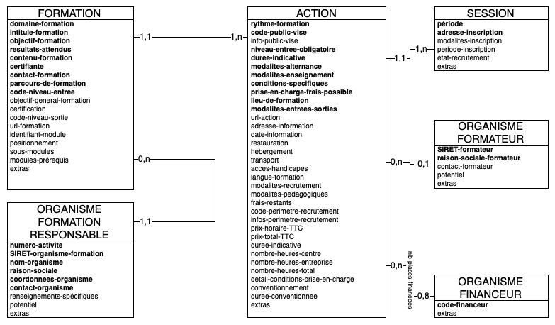

Modèle de données simplifié
---------------------------

Le schéma ci-dessous décrit le modèle de données associé à la représentation d'une offre de formation au format LHÉO. L'entité principale :ref:`formation` peut posséder de 1 à n entités :ref:`action` qui peut posséder de 1 à n entités :ref:`session`. L'entité :ref:`formation` est associée à une et une seule entité représentant l':ref:`organisme-formation-responsable`. Les entités :ref:`action` peuvent de leur côté être éventuellement associées à une entité :ref:`organisme-formateur` et à plusieurs entités :ref:`organisme-financeur`.

On peut noter que les entités :ref:`action` et :ref:`session` sont des entités *faibles* dans le sens où ces entités ne peuvent exister sans respectivement une :ref:`formation` parente et une :ref:`action` parente, matérialisation d'une organisation hiérarchique des données: une entité :ref:`action` (respectivement :ref:`session`) ne peut donc pas être rattachée à plusieurs entités :ref:`formation` (respectivement :ref:`action`).

